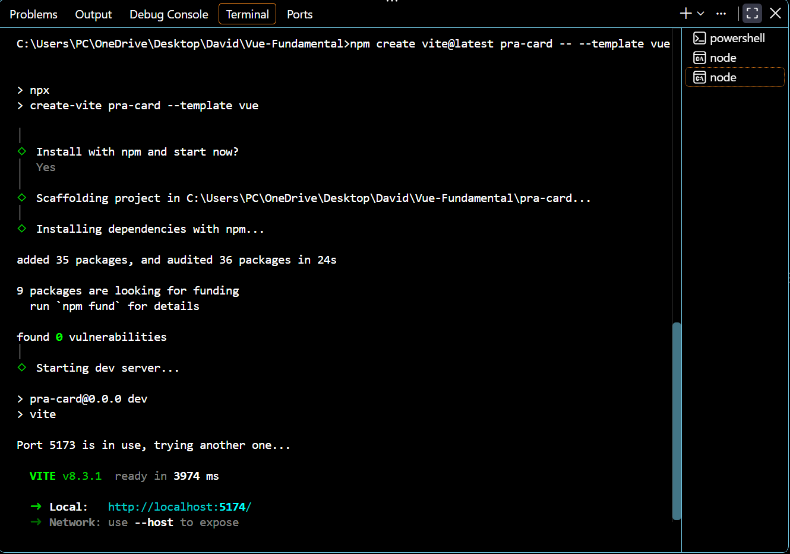
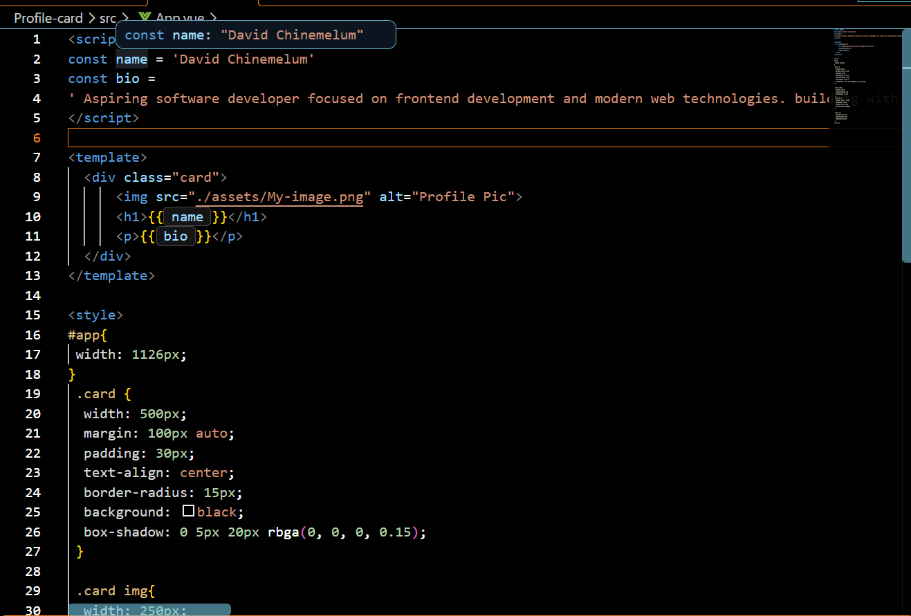
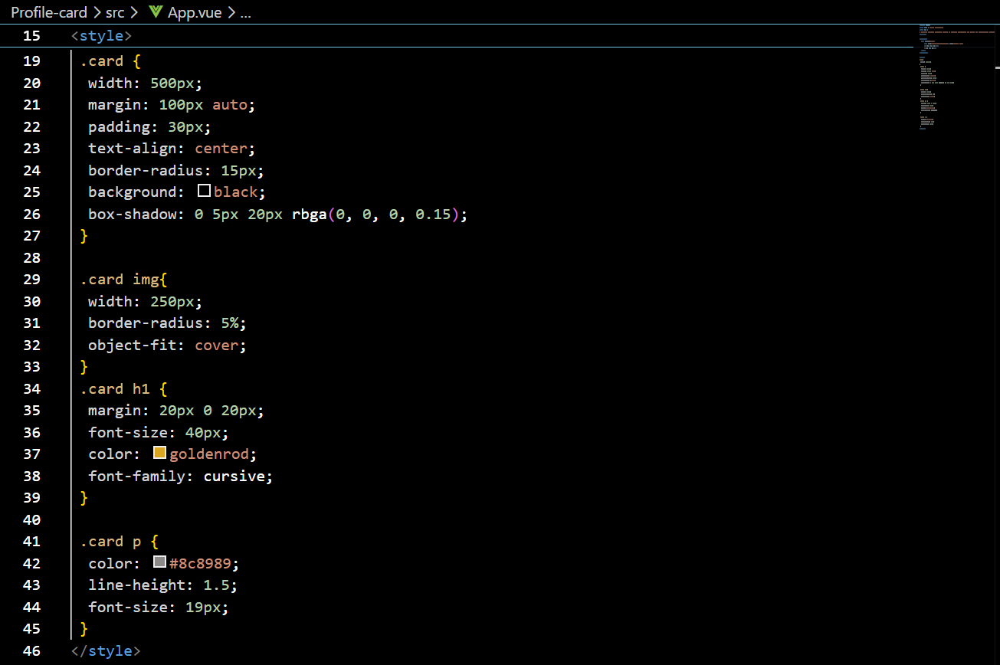
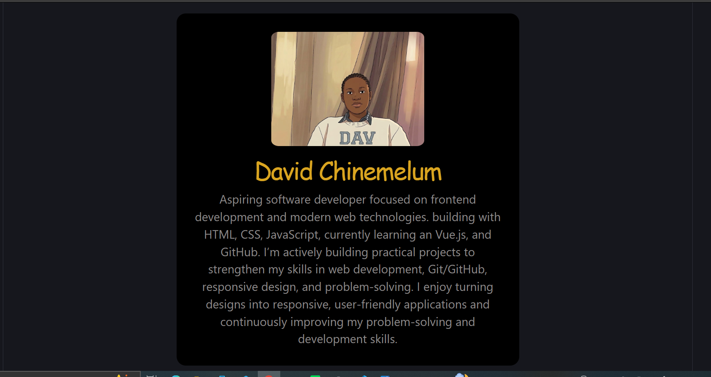

# Day 1  — Setup & First Component. ✅

- Topic
 Node/Vite setup, project structure.


- Milestone
  Scaffold a Vite + Vue 3 app and render a personal profile card (name, photo, bio).

## Project Setup.
1. Created a new project folder - Vue-Fundamental.

```sh
# Vue Installation.
 npm create vite@latest Profile-card -- --template vue
```
this automatically creates the project folder, install dependencies and run the dev.

### Terminal Output
 

## Creation of Profile Card
Unveiling the base of every .vue file:
```sh
# <template></template> → what appears on the page
# <script> → the logic/data
# <style> → how it looks
```g

- Name: created in srcipt section with "const name ='David Chinemelum' "
- Photo: imported from "src/assets/" 
- Bio: description of my tech background.

## Styling
This contains the overall look of the Profile card.

## Script
The logic/functional of the profile card.

### Terminal Output
 
 

## GitHub Pushing.
1. Git initialization:
  git init
2. Commiting, Staging and Pushing:
```sh
  git add .
  git commit -m "Initial commit"
  git branch -M main
  git remote add origin https://github.com/David-udroid/Vue-fundamental.git
  git push -u origin main
```
## Final Result
- Day 1 final deliverable is:

A polished, responsive personal developer profile card built with Vue 3 + Vite and hosted in your GitHub repository.

