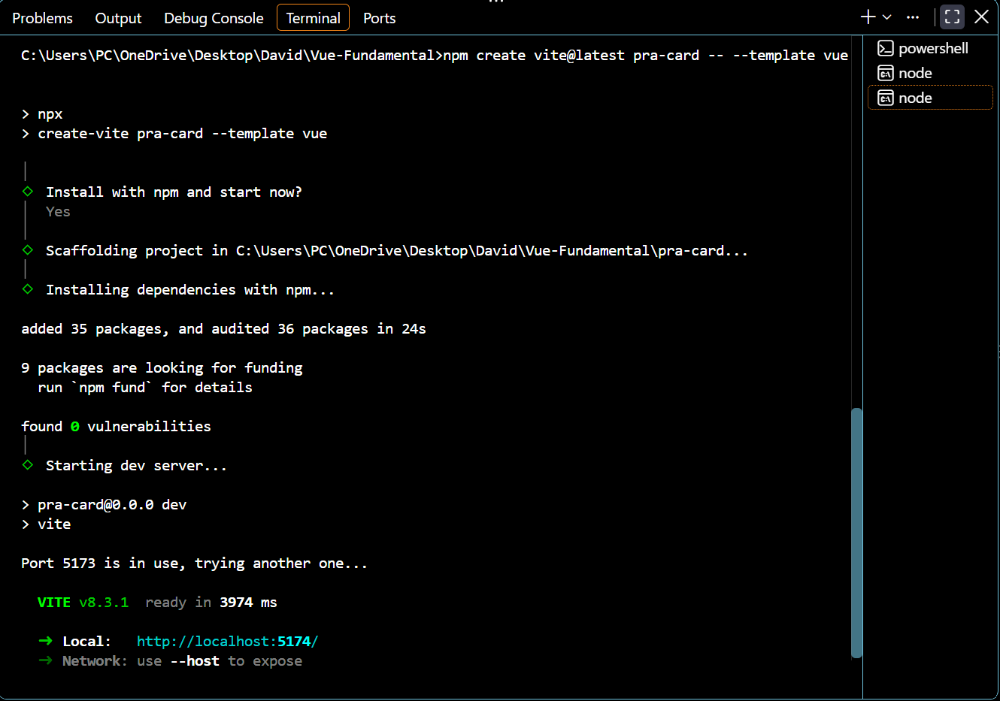
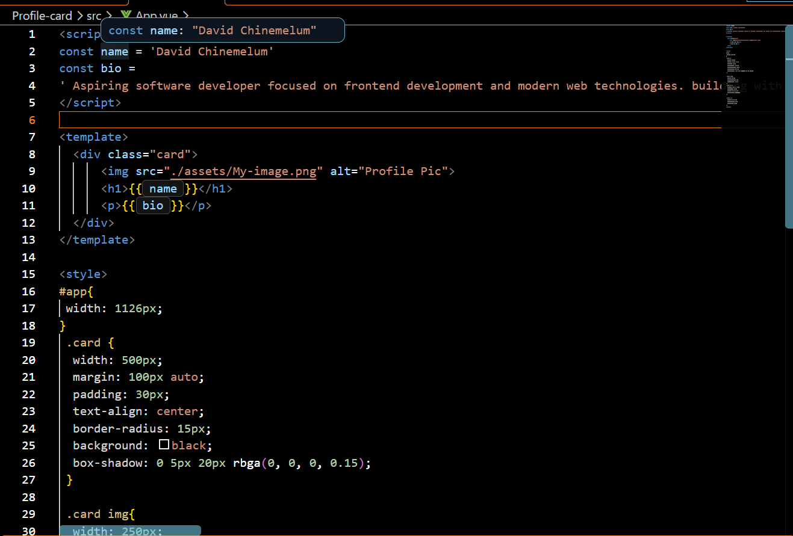
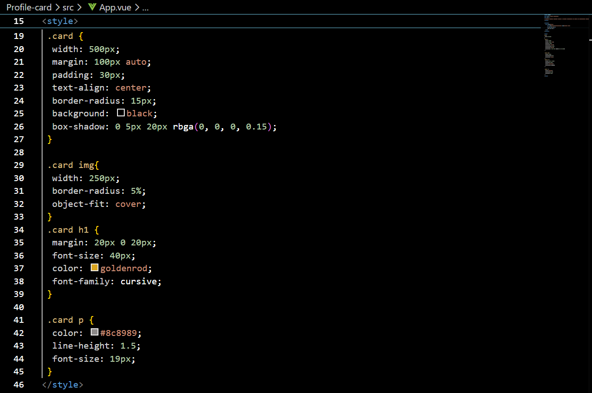
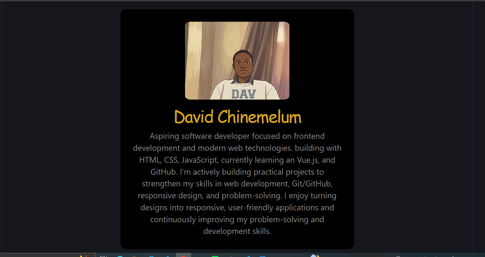
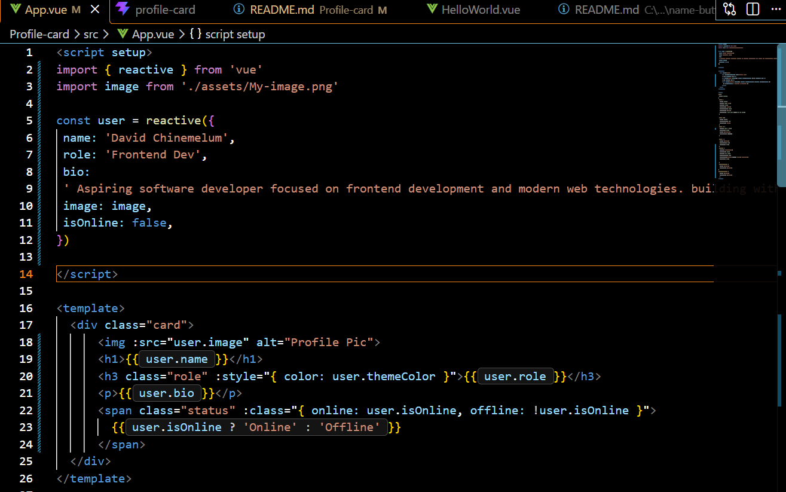
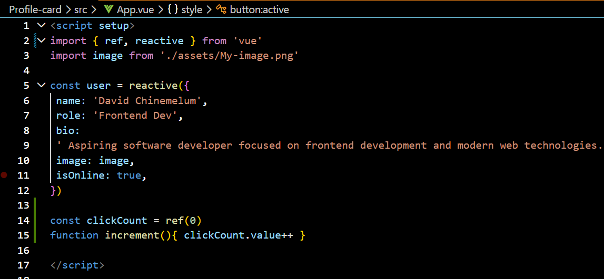
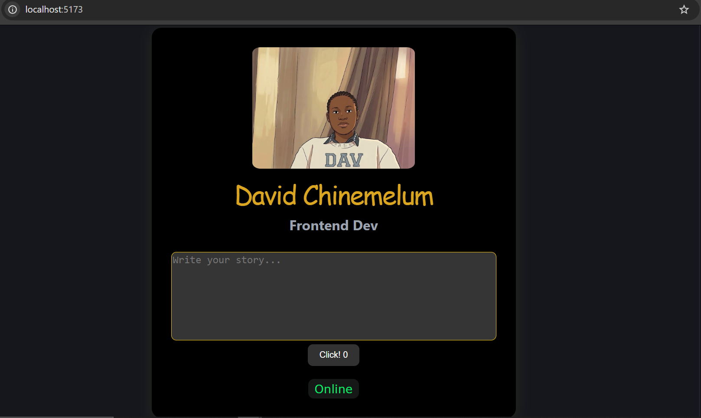

# Day 1  — Setup & First Component. ✅

- Topic:
 Node/Vite setup, project structure.


- Milestone:
  Scaffold a Vite + Vue 3 app and render a personal profile card (name, photo, bio).

## Project Setup.✨
1. Created a new project folder - Vue-Fundamental.

```sh
# Vue Installation.
 npm create vite@latest Profile-card -- --template vue
```
this automatically creates the project folder, install dependencies and run the dev.

### Terminal Output
 

## Creation of Profile Card
<!-- Unveiling the base of every .vue file:
```sh
# <template></template> → what appears on the page
# <script> → the logic/data
# <style> → how it looks
``` -->

- Name: created in srcipt section with "const name ='David Chinemelum' 
- Photo: imported from "src/assets/" 
- Bio: description of my tech background.

## Styling
This contains the overall look of the Profile card.

## Script
The logic/functional of the profile card.

### Terminal Output🔥
 
 

## GitHub.🔥
1. Git initialization:
  git init
2. Commiting, Staging and Pushing:
```sh
  git add .
  git commit -m "Initial commit"
  git branch -M main
  git remote add origin https://github.com/David-udroid/Vue-fundamental.git
  git push -u origin main
```
## Final Result👩🏿‍💻
- Day 1 final deliverable is:

A polished, responsive personal developer profile card built with Vue 3 + Vite and hosted in your GitHub repository.



### What I learned😀:
 - learnt how to setup and bulid a profile card.

# Day 2 — Template Syntax & Interpolation.✅

### Topic:
`{{ }}` interpolation, `v-bind` (attribute binding), and class/style binding.

### Milestone:
Make the profile card dynamic — data comes from a JS object, not hardcoded HTML.

## Project Overview
 For Day 2, I updated my Vue.js profile card to make it dynamic. Instead of writing the profile information directly in the HTML, I stored the information inside a JavaScript object and used Vue template syntax to display it.

## Step Completed☑️:
1. Created a Profile Object.
I created a JavaScript object containing my profile information:
```js
const user = reactive({
 name: 'David Chinemelum',
 role: 'Frontend Dev', 
 bio: 
 ' A software developer focused on frontend development ...',
 image: image,
 isOnline: false,
})
```
2. Used Interpolation.
 Replaced hardcoded text in the template with `{{ }}` interpolation.
```html
 <h1>{{ user.name }}</h1>
 <h3 class="role" :style="{ color: user.themeColor }">{{ user.role }}</h3>
 <p>{{ user.bio }}</p>
```
3. Added Attribute Binding.
 Replaced hardcoded attributes (`src`, `alt`, `href`) with `v-bind` (`:`) bindings.
```html

```
4. Added Class Binding.
I used :class to dynamically apply a CSS class.
```html
 <span class="status" :class="{ online: user.isOnline, offline: !user.isOnline }">
  {{ user.isOnline ? 'Online' : 'Offline' }}
   </span>
```
5. Added Style Binding.
Bound the card border and role text color to `user.themeColor` with style binding.
```html
<h3 class="role" :style="{ color: user.themeColor }">{{ user.role }}</h3>
```

## Bound Properties.
- Interpolation - `{{ user.name }}` , `{{ user.bio }}`
- Attribute binding - `:src="user.avatar"` 
- Class binding - `:class="{ online: user.isOnline }" `

## Git Commands

git add .
git commit -m "Complete Day 2 dynamic profile card"
git push

## Result👩🏾‍💻.
A screenshot of the completed ynamic profile card


Offline -  `isOnline: false`


## What I learned😀:

- **Interpolation (`{{ }}`)** renders text from data. It accepts expressions only (no `if` statements), so I used a ternary for conditional text.
- **`v-bind` (shorthand `:`)** connects an HTML attribute to a JS expression. Attribute binding is its most common use, e.g. `:src` and `:href`.
- **Class binding** uses the object syntax to toggle classes based on data, e.g. `:class="{ online: user.isOnline }"`.
- **Style binding** takes an object with camelCase properties, e.g. `:style="{ borderColor: user.themeColor }"`.


# Day 3: Reactivity Basics.✅

### Topic:
`ref()`, `reactive()`, the reactivity system

### Milestone:
Added a click counter and a live-editable bio field to the profile card

## Project Overview
For Day 3, I updated my Vue.js profile card by introducing Vue's reactivity system. I added a click counter and a live-editable bio field so that the profile card responds immediately to user interactions.

## Step Completed☑️:
### 1. **`Ref ()`** function.
 This wraps single values; access with `.value` in script, auto-unwrapped in the template.
```js
 import { ref } from 'vue'
const count = ref(0)
function increment(){ clickCount.value++ }
```
The counter increases whenever the button is clicked.

### 2. **`Reactive()`** Function.
 - This Keeps `user` as a `reactive` object.
 - It makes objects deeply reactive; access properties directly.
```js
 import { reactive } from 'vue'
```


### 3. Added a Live-Editable Bio. 
- Bounded a textarea to `user.bio` with `v-model` so the bio updates as I type.
- used `v-model` to connect a textarea to the reactive `profile.bio` property.
```html
<textarea
  v-model="user.bio"
  class="bio-build"
  rows="7"
  placeholder="Write your story...">
</textarea>
```
### 4. Click Counter.
-Added a button using `@click` to update the counter.
- A button that changes the counter every time it is clicked.
```html
<button @click="increment">
  Click! {{ clickCount }} 
</button>
```
*Result*👩🏾‍💻.


### 5. Screen Recording:
A video recording showing all day-3 reactivity features.

[Watch the screen recording](./src/assets/recordings.mp4)

## Git Commands.
I saved and pushed my changes to GitHub.

git add .
git commit -m " Day 3 reactivity basics "
git push

## What I Learned😀:
 - `ref()` wraps single values; access with `.value` in script, auto-unwrapped in the template.
 - `reactive()` makes objects deeply reactive; access properties directly.
 - Reassigning or destructuring a `reactive` object breaks reactivity.
